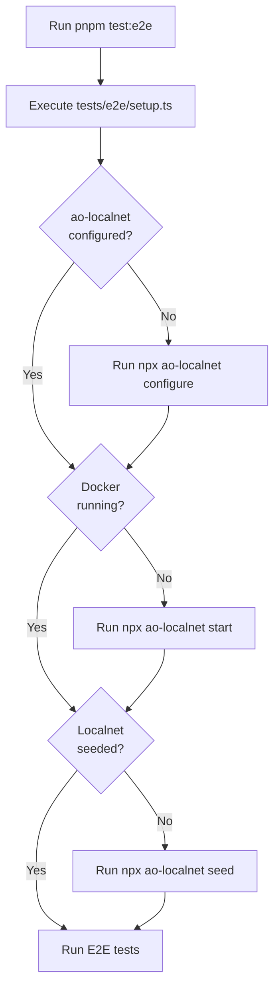

# AO Localnet Autoseed Integration

This document describes how our E2E tests integrate with ao-localnet's autoseed functionality.

## Overview

The ao-localnet package now includes automatic configuration and seeding capabilities. Our E2E tests automatically:

1. ✅ Check if ao-localnet is configured (wallets generated, AOS module downloaded)
2. ✅ Check if Docker services are running
3. ✅ Check if localnet is seeded (scheduler location published, etc.)
4. ✅ Automatically configure/start/seed if needed
5. ✅ Run tests against the ready localnet environment

## Quick Start

Just run the E2E tests - setup happens automatically:

```bash
pnpm test:e2e
```

That's it! The test suite will:
- Configure ao-localnet if needed (generates wallets, downloads AOS module)
- Start Docker services if not running
- Seed the localnet with initial data (scheduler location, AOS module)
- Run all E2E tests

## Manual Control

If you want to manually manage ao-localnet:

### Full Setup (One Command)
```bash
pnpm localnet:configure  # Generate wallets + download AOS module
pnpm localnet:start      # Start Docker services
pnpm localnet:seed       # Seed initial data
```

### Individual Commands
```bash
# Configuration
pnpm localnet:configure  # Generate wallets and download AOS module

# Docker Services
pnpm localnet:start      # Start services
pnpm localnet:stop       # Stop services (keeps data)

# Data Management
pnpm localnet:seed       # Seed initial data (scheduler, AOS module)
pnpm localnet:reset      # Delete all data
pnpm localnet:reseed     # Reset + reseed

# Utilities
pnpm localnet:spawn      # Spawn an AOS process
pnpm localnet:aos        # Connect to AOS REPL
```

## Architecture

### Files

**New Files:**
- `tests/utils/ao_localnet_manager.ts` - Programmatic interface to ao-localnet CLI
- `tests/e2e/setup.ts` - Global test setup that runs before all E2E tests

**Updated Files:**
- `tests/utils/ao_localnet_config.ts` - Reads config from seeded ao-localnet
- `package.json` - Updated `test:e2e` script to run setup first

### How It Works



### Configuration Flow

1. **ao-localnet configure** generates:
   - `wallets/ao-wallet.json` - Main wallet for signing
   - `wallets/aos-module-publisher-wallet.json` - For publishing modules
   - `wallets/scheduler-location-publisher-wallet.json` - For scheduler location
   - Other utility wallets
   - Downloads AOS WASM module from mainnet

2. **ao-localnet start** launches Docker services:
   - ArLocal (Gateway) - Port 4000
   - MU (Messenger Unit) - Port 4002
   - SU (Scheduler Unit) - Port 4003
   - CU (Compute Unit) - Port 4004
   - ScAR (Block Explorer) - Port 4006
   - Bundler - Port 4007

3. **ao-localnet seed** publishes to ArLocal:
   - Scheduler Location transaction
   - AOS Module transaction
   - Updates `.ao-localnet.config.json` with transaction IDs

4. **Our tests read** from `.ao-localnet.config.json`:
   - `bootstrap.transactions.scheduler` - Scheduler wallet address
   - `bootstrap.transactions.aosModule` - AOS module ID
   - `bootstrap.transactions.schedulerLocation` - Scheduler location TX ID
   - `wallets.aoWallet` - Path to wallet file
   - `urls.*` - Service endpoints

## Configuration File

After seeding, `.ao-localnet.config.json` looks like:

```json
{
  "urls": {
    "gateway": "http://localhost:4000",
    "graphql": "http://localhost:4000/graphql",
    "mu": "http://localhost:4002",
    "su": "http://localhost:4003",
    "cu": "http://localhost:4004",
    "bundler": "http://localhost:4007"
  },
  "wallets": {
    "aoWallet": "./wallets/ao-wallet.json"
  },
  "bootstrap": {
    "transactions": {
      "scheduler": "QEz1f...",
      "aosModule": "e-pBlP...",
      "schedulerLocation": "mK5n2Z..."
    }
  }
}
```

## Helper Functions

### ao_localnet_manager.ts

```typescript
import { 
  setupLocalnet,      // Full setup (configure + start + seed)
  checkLocalnetStatus, // Check current status
  configureLocalnet,   // Configure wallets and module
  startLocalnet,       // Start Docker services
  seedLocalnet,        // Seed initial data
  stopLocalnet,        // Stop services
  resetLocalnet        // Reset and reseed
} from './tests/utils/ao_localnet_manager.js';

// In your test setup
await setupLocalnet();
```

### ao_localnet_config.ts

```typescript
import {
  getUrls,              // Get service URLs
  getScheduler,         // Get scheduler wallet address
  getAosModule,         // Get AOS module ID
  getAuthorityAddress,  // Get authority wallet address (async)
  getAoWallet,          // Get wallet JWK
  getAoInstance,        // Get configured aoconnect instance
  createLocalnetSigner  // Create DataItemSigner
} from './tests/utils/ao_localnet_config.js';

const moduleId = getAosModule();
const wallet = getAoWallet();
const authority = await getAuthorityAddress();
```

## Troubleshooting

### Tests fail with "module not found"

The ao-localnet hasn't been configured/seeded yet. Run:

```bash
pnpm localnet:configure
pnpm localnet:start
pnpm localnet:seed
```

Or just run `pnpm test:e2e` which does this automatically.

### Docker not running

Make sure Docker Desktop is running:

```bash
docker ps
```

### Services not healthy

Check service status:

```bash
cd node_modules/ao-localnet
docker compose ps
docker compose logs
```

### Config file missing fields

Delete and regenerate:

```bash
pnpm localnet:reset
pnpm localnet:configure
pnpm localnet:seed
```

### Wallet file not found

Run configure to generate wallets:

```bash
pnpm localnet:configure
```

## Migration from Manual Setup

**Before (Manual):**
```bash
# Had to manually:
# 1. Generate wallets
# 2. Download AOS module
# 3. Start Docker
# 4. Publish scheduler location
# 5. Publish AOS module
# 6. Update config file with IDs
# 7. Hope everything worked
```

**After (Autoseed):**
```bash
pnpm test:e2e  # Everything happens automatically!
```

## Benefits

✅ **Zero Manual Setup** - Tests handle everything automatically
✅ **Reproducible** - Same setup every time
✅ **Fast** - Skips steps that are already done
✅ **Reliable** - Proper error handling and validation
✅ **Developer Friendly** - Just run tests, don't think about setup

## References

- [ao-localnet README](../node_modules/ao-localnet/README.md)
- [ao-localnet Test README](../node_modules/ao-localnet/tests/README.md)
- [Original SDK Integration Docs](./SDK_INTEGRATION_COMPLETE.md)

