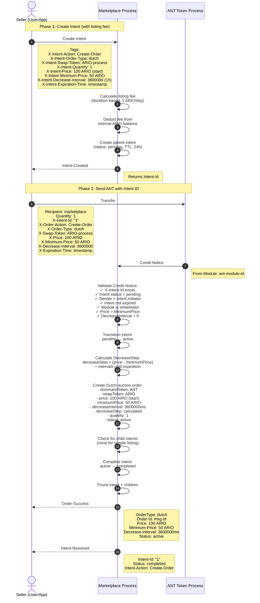
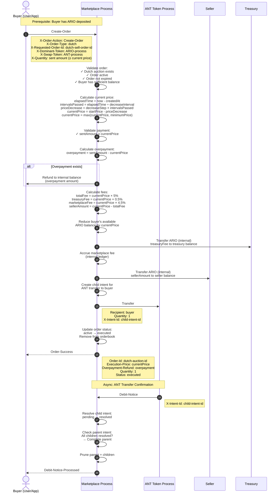

# Dutch Auction Orders

## Overview

Dutch auction orders enable time-based price discovery where the price automatically decreases from a starting price to a minimum price over configured intervals. Sellers list ANTs via the **Intent-Based Workflow Pattern** (ADR-004), and the first buyer to purchase at the current price wins instantly.

## Architecture Patterns

- **Intent-Based Workflow** (ADR-004): ANT listings tracked with parent/child intents
- **ARIO Internal Ledger** (ADR-003): Instant ARIO transfers via internal balance
- **Credit-Notice Pattern** (ADR-002): ANT transfer validation and ARIO deposit routing
- **Module Whitelist** (ADR-001): ANT module verification for security
- **Dynamic Pricing**: Real-time price calculation based on elapsed time

---

## Part 1: Creating Dutch Auction Listings (Sell Side)

### Listing Overview

Creating a Dutch auction requires a two-phase approach with time-based price parameters:
1. **Phase 1**: Create intent and pay listing fee
2. **Phase 2**: Send ANT with Dutch auction parameters

### Listing Workflow Diagram



### Phase 1: Create Intent (Listing Fee Payment)

**Purpose**: Reserve workflow slot and pay listing fee upfront

**Requirements**:
- Seller must have ARIO deposited in marketplace internal balance
- Sufficient balance to cover duration-based listing fee
- Valid expiration time (future timestamp, max 30 days, **required** for Dutch)
- Starting price > minimum price
- Decrease interval > 0

**Dutch Auction Parameters**:
- `X-Intent-Price`: Starting price (highest price)
- `X-Intent-Minimum-Price`: Floor price (lowest price)
- `X-Intent-Decrease-Interval`: Milliseconds between price drops
- `X-Intent-Expiration-Time`: When auction ends (**required** for Dutch)

**Listing Fee Calculation**:
```
baseFee = 1 ARIO (for first day)
feeMultiplier = ceil(durationHours / 24)
totalFee = baseFee * feeMultiplier

Examples:
- 1 day auction: 1 ARIO
- 7 day auction: 7 ARIO  
- 30 day auction: 30 ARIO
```

**Error Scenarios**:
- Insufficient ARIO balance → Error: "Insufficient balance"
- Price ≤ MinimumPrice → Error: "Price must be greater than minimum price"
- DecreaseInterval ≤ 0 → Error: "Decrease interval must be positive"
- No expiration time → Error: "Expiration time required for Dutch auctions"

### Phase 2: Send ANT with Intent ID

**Purpose**: Transfer ANT to marketplace with Dutch auction parameters

**Dutch Auction Calculation**:

The marketplace calculates how much the price should decrease per interval:

```lua
-- Calculate total time until expiration
totalDuration = expirationTime - createdAt

-- Calculate number of intervals
numberOfIntervals = floor(totalDuration / decreaseInterval)

-- Calculate price drop per interval
totalPriceRange = price - minimumPrice
decreaseStep = totalPriceRange / numberOfIntervals
```

**Example**:
- Starting price: 100 ARIO
- Minimum price: 50 ARIO
- Decrease interval: 1 hour (3600000ms)
- Expiration: 10 hours from now
- → Number of intervals: 10
- → Price range: 50 ARIO (100 - 50)
- → Decrease step: 5 ARIO per hour (50 ÷ 10)

**Price Timeline**:
```
Hour 0: 100 ARIO
Hour 1: 95 ARIO  (100 - 5)
Hour 2: 90 ARIO  (95 - 5)
...
Hour 9: 55 ARIO  (60 - 5)
Hour 10: 50 ARIO (minimum reached)
```

**Order Creation**:
- `id`: Message ID from ANT transfer
- `creator`: Seller address
- `token`: ANT process ID (dominantToken)
- `quantity`: "1" (always 1 ANT)
- `price`: Starting price in mARIO
- `minimumPrice`: Floor price in mARIO
- `decreaseInterval`: Milliseconds between drops (string)
- `decreaseStep`: Calculated price drop per interval (string)
- `orderType`: "dutch"
- `status`: "active"
- `dateCreated`: Credit-Notice timestamp
- `expirationTime`: Auction end timestamp
- `dominantToken`: ANT process ID
- `swapToken`: ARIO process ID

### Price Decay Mechanism

**Current Price Calculation**:

When a buyer queries or purchases, marketplace calculates current price:

```lua
function dutch_auction.getCurrentPrice(order, currentTimestamp)
    local startPrice = bint(order.price)
    local minimumPrice = bint(order.minimumPrice)
    local createdAt = order.dateCreated
    local decreaseInterval = bint(order.decreaseInterval)
    local decreaseStep = bint(order.decreaseStep)
    
    -- Calculate elapsed time
    local elapsedTime = bint(currentTimestamp) - bint(createdAt)
    
    -- Calculate number of intervals passed
    local intervalsPassed = elapsedTime / decreaseInterval
    
    -- Calculate total price decrease
    local totalDecrease = decreaseStep * intervalsPassed
    
    -- Calculate current price
    local currentPrice = startPrice - totalDecrease
    
    -- Floor at minimum price
    if currentPrice < minimumPrice then
        currentPrice = minimumPrice
    end
    
    return tostring(currentPrice)
end
```

**Minimum Price Floor**:

Once minimum price is reached, price stops decreasing:

```
If currentPrice < minimumPrice:
    return minimumPrice
```

This ensures the seller's floor price is respected even if auction continues.

---

## Part 2: Purchasing Dutch Auction Orders (Buy Side)

### Purchase Overview

Buyers purchase ANTs at the dynamically-calculated current price. The first buyer to purchase wins, and excess payment is automatically refunded.

### Purchase Workflow Diagram



### Prerequisites

**Buyer Requirements**:
1. ARIO deposited in marketplace internal balance
2. Available balance ≥ current Dutch auction price
3. Understanding of Dutch auction mechanics (price drops over time)

**Seller Requirements**:
1. Valid Dutch auction sell order exists
2. Order status is "active"
3. Order not expired
4. ANT module is whitelisted

### Order Creation Message

Buyer sends `Create-Order` message with:
- `X-Order-Action`: "Create-Order"
- `X-Order-Type`: "dutch" (optional, inferred from matched order)
- `X-Requested-Order-Id`: ID of the Dutch auction to buy
- `X-Dominant-Token`: ARIO process ID
- `X-Swap-Token`: ANT process ID
- `X-Quantity`: Payment amount in mARIO (can be ≥ current price)

**Important**: 
- This is a direct message to marketplace, NOT a Credit-Notice
- Buyer should send ≥ current price (excess is refunded automatically)
- Current price is calculated at execution time, not message send time

### Current Price Calculation

**Critical step**: Marketplace calculates current price based on execution timestamp.

**Example Timeline**:
```
Dutch auction parameters:
- Start price: 100 ARIO
- Minimum price: 50 ARIO
- Decrease interval: 1 hour
- Decrease step: 5 ARIO/hour

Time T0 (created): currentPrice = 100 ARIO
Time T0 + 1h:      currentPrice = 95 ARIO  (100 - 5×1)
Time T0 + 3h:      currentPrice = 85 ARIO  (100 - 5×3)
Time T0 + 5h:      currentPrice = 75 ARIO  (100 - 5×5)
Time T0 + 10h:     currentPrice = 50 ARIO  (reached minimum)
Time T0 + 15h:     currentPrice = 50 ARIO  (stays at minimum)
```

### Payment Validation and Overpayment Refund

```lua
local sentAmount = bint(msg.Tags['X-Quantity'])
local currentPrice = bint(dutch_auction.getCurrentPrice(order, msg.Timestamp))

-- Validate buyer sent enough
assert(sentAmount >= currentPrice, "Insufficient payment for current Dutch price")

-- Calculate overpayment
local overpayment = sentAmount - currentPrice

-- Refund overpayment to buyer's internal balance
if overpayment > bint(0) then
    balances.increaseBalance(buyer, tostring(overpayment))
end
```

**Example**:
- Current price: 75 ARIO
- Buyer sends: 80 ARIO
- Overpayment: 5 ARIO
- Buyer charged: 75 ARIO
- Buyer refunded: 5 ARIO (to internal balance)

**Why overpayment happens**:
- Buyer queries price at time T1: 80 ARIO
- Buyer sends order message
- Message executes at time T2: price dropped to 75 ARIO
- Buyer benefits from price drop even if they sent more

### Fee Calculation

Fees calculated on **current price**, not sent amount:

```
currentPrice = 75 ARIO (75000000000 mARIO)
totalFeePercent = 5%
totalFee = currentPrice * 0.05 = 3.75 ARIO

treasuryFeePercent = 0.5%
treasuryFee = currentPrice * 0.005 = 0.375 ARIO

marketplaceFeePercent = 4.5%
marketplaceFee = currentPrice * 0.045 = 3.375 ARIO

sellerAmount = currentPrice - totalFee = 71.25 ARIO
```

### Internal ARIO Transfers

All ARIO transfers happen **internally** (no external messages):

1. **Buyer → Deducted**: `balances.reduceBalance(buyer, currentPrice)`
2. **Buyer → Refunded** (if overpayment): `balances.increaseBalance(buyer, overpayment)`
3. **Treasury → Credited**: `balances.increaseBalance(treasury, treasuryFee)`
4. **Marketplace → Accrued**: `utils.accrueFee(marketplaceFee)`
5. **Seller → Credited**: `balances.increaseBalance(seller, sellerAmount)`

**Net effect**:
- Buyer: -currentPrice (overpayment already refunded)
- Seller: +sellerAmount
- Treasury: +treasuryFee
- Marketplace: +marketplaceFee

### Order Status Update

Order immediately transitions to "executed":
- `status`: "active" → "executed"
- Removed from `Orderbook[pair]` dictionary
- Cleared from `OrderIndex` lookup table

**Instant settlement**: Dutch auctions settle immediately on first purchase (no bidding period).

### Balance State Changes

**Before Purchase (at hour 5)**:

Current price: 75 ARIO

```lua
ARIOBalances = {
  [buyer] = {
    balance = "100000000000",  -- 100 ARIO available
    orders = {}
  },
  [seller] = {
    balance = "0",
    orders = {}
  }
}
```

**After Purchase**:

Buyer sent 80 ARIO, current price was 75 ARIO:

```lua
ARIOBalances = {
  [buyer] = {
    balance = "25000000000",  -- 100 - 75 = 25 ARIO (overpayment refunded)
    orders = {}
  },
  [seller] = {
    balance = "71250000000",  -- 71.25 ARIO (75 - 5% fees)
    orders = {}
  },
  [treasury] = {
    balance = "375000000",  -- 0.375 ARIO fee
    orders = {}
  }
}

AccruedFeesAmount = "3375000000"  -- 3.375 ARIO marketplace fee
```

**Overpayment handling**:
- Buyer sent: 80 ARIO
- Buyer charged: 75 ARIO
- Buyer refunded: 5 ARIO (to internal balance)
- Buyer final balance: 100 - 80 + 5 = 25 ARIO ✅

---

## Buyer Strategies

### Conservative (Pay More, Buy Now)
```
Query price: 85 ARIO at hour 3
Send order: 90 ARIO immediately
Execute: 85 ARIO (or lower if price dropped)
Refund: 5 ARIO (or more)
Result: Buy immediately, accept current price
```

### Opportunistic (Wait for Drop)
```
Query price: 85 ARIO at hour 3
Wait: 2 more hours
Query price: 75 ARIO at hour 5
Send order: 80 ARIO
Execute: 75 ARIO (or lower)
Refund: 5 ARIO (or more)
Risk: Someone else might buy first
```

### Minimum Price Sniper
```
Calculate: Minimum price reached at hour 10
Wait: Until hour 10
Send order: 50 ARIO (minimum price)
Execute: 50 ARIO
Refund: 0 ARIO
Risk: Auction might sell before minimum price
```

### Price Race Conditions

**Scenario**: Two buyers send orders simultaneously

```
Time T0 + 5h: Current price = 75 ARIO
Buyer A sends: 80 ARIO at timestamp 1234567890
Buyer B sends: 85 ARIO at timestamp 1234567891

Marketplace processes messages in order:
1. Buyer A's message executes first
   - Current price calculated: 75 ARIO
   - Buyer A wins
   - Order status: executed
   
2. Buyer B's message arrives 1ms later
   - Order already executed
   - Error: "Order not found" or "Order already filled"
   - Buyer B's ARIO not deducted
```

**First message wins** - Dutch auctions are first-come-first-served at current price.

---

## Querying Current Price

Before purchasing, buyers should query current price:

```
Buyer → Marketplace: Get-Order
  Order-Id: dutch-auction-id

Marketplace response:
{
  "id": "dutch-auction-id",
  "orderType": "dutch",
  "price": "100000000000",        // Start: 100 ARIO
  "minimumPrice": "50000000000",  // Floor: 50 ARIO
  "currentPrice": "75000000000",  // Now: 75 ARIO ⭐
  "decreaseInterval": "3600000",  // 1 hour
  "decreaseStep": "5000000000",   // 5 ARIO/hour
  "dateCreated": 1234567890,
  "expirationTime": 1234603890,
  "status": "active"
}
```

**Buyer decision**:
- Current price: 75 ARIO
- Is 75 ARIO fair for this ANT?
- Will price drop to 70 ARIO in 1 hour?
- Risk someone else buys before next drop?

---

## Order Cancellation

Seller can cancel Dutch auction before anyone buys:

```
Seller → Marketplace: Cancel-Order
  Order-Id: dutch-auction-id

Marketplace:
1. Validates sender is order creator
2. Validates order is active (not executed)
3. Creates child intent for ANT return
4. Transfers ANT back to seller
5. Updates order status to "cancelled"
6. Removes from orderbook

Note: Listing fee NOT refunded
```

---

## Order Expiration

If auction expires without any purchase:

```
Pruning system (triggered on any message):
1. Detects order.expirationTime < current timestamp
2. Creates child intent for ANT return
3. Transfers ANT back to seller
4. Updates order status to "expired"
5. Removes from orderbook
6. Sends Order-Expired notice to seller

Note: Listing fee NOT refunded
```

---

## State Transitions

### Intent States
```
Created → Pending → Active → Completed
                       ↓
                    Failed
```

### Order States  
```
Created → Active → Executed (when bought at current price)
              ↓
           Cancelled (manual cancel by seller)
              ↓
           Expired (via pruning system)
```

---

## Dutch vs Fixed Price

| Feature | Dutch Auction | Fixed Price |
|---------|--------------|-------------|
| Price | Decreases over time | Static |
| Settlement | Instant on first buy | Instant on match |
| Buyer Strategy | Wait for lower price | Buy immediately if fair |
| Seller Strategy | Set high start, low floor | Set fair price |
| Market Efficiency | Price discovery | Direct valuation |
| Use Case | Uncertain value | Known value |

---

## Error Scenarios

### Listing Errors
- Price ≤ Minimum price → Error: "Price must be greater than minimum price"
- Decrease interval ≤ 0 → Error: "Decrease interval must be positive"
- Missing expiration → Error: "Expiration time required for Dutch auctions"

### Purchase Errors
- Insufficient balance → Error: "Insufficient balance"
- Order not found or already executed → Error: "Order not found"
- Order expired → Error: "Order expired"
- Insufficient payment (underpayment) → Error: "Insufficient payment for current Dutch price"
- ANT transfer failure → Intent fails, ARIO not refunded automatically

---

## Notice Emissions

### Listing Path
- `Intent-Created` (after Phase 1)
- `Order-Success` (after Phase 2)
- `Intent-Resolved` (after Phase 2)

### Purchase Path
- `Order-Success` (immediate after execution, includes `Execution-Price` and `Overpayment-Refund`)
- `Debit-Notice-Processed` (when ANT confirms)

### Cancellation/Expiration Path
- `Order-Cancelled` or `Order-Expired`
- `Debit-Notice-Processed` (when ANT return confirms)

### Error Path
- `Validation-Error` (if validation fails)
- `Insufficient-Payment` (if underpayment)
- `Transfer-Error` (if ANT transfer fails)

---

## References

- **ADR-004**: Intent-Based Workflow Pattern
- **ADR-003**: ARIO Internal Ledger Pattern
- **ADR-002**: Credit-Notice Pattern
- **ADR-001**: Module Whitelist for ANT Trading
- **FEATURE_CHECKLIST.md**: Complete feature implementation status
- **Source**: `src/intents.lua`, `src/notices.lua`, `src/dutch_auction.lua`, `src/balances.lua`, `src/ucm.lua`

