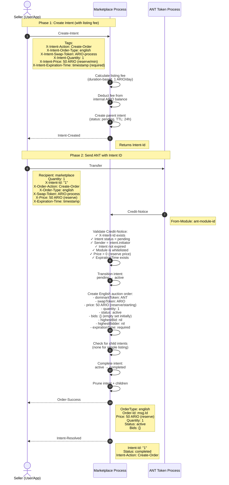
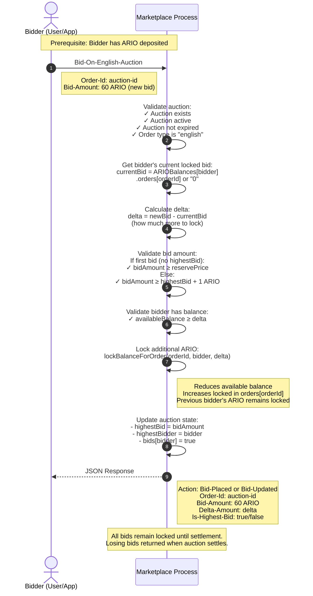
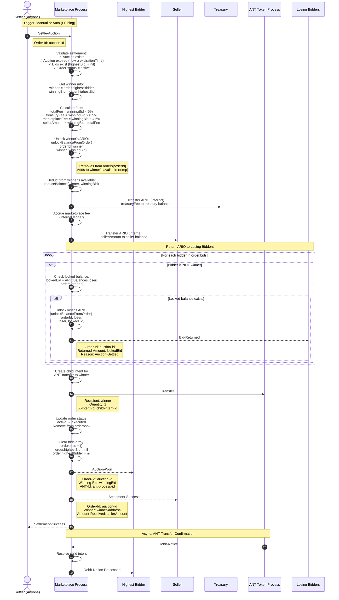

# English Auction Orders

## Overview

English auction orders enable competitive bidding where bidders place ascending bids until auction expiration. The highest bidder wins after expiration, with **all bids held locked until settlement** when losing bids are returned and the winning bid is transferred to the seller.

## Architecture Patterns

- **Intent-Based Workflow** (ADR-004): ANT listings tracked with parent/child intents
- **ARIO Internal Ledger** (ADR-003): Bid locking and settlement via internal balance
- **Credit-Notice Pattern** (ADR-002): ANT transfer validation and ARIO deposit routing
- **Module Whitelist** (ADR-001): ANT module verification for security
- **Hold-All-Bids Model**: All bids remain locked until auction settles
- **Delta Calculation**: Contract-side calculation of bid increments for efficient re-bidding

---

## Part 1: Creating English Auction Listings (Sell Side)

### Listing Overview

Creating an English auction requires a two-phase approach with a reserve price and required expiration:
1. **Phase 1**: Create intent and pay listing fee
2. **Phase 2**: Send ANT with English auction parameters

### Listing Workflow Diagram



### Phase 1: Create Intent (Listing Fee Payment)

**Purpose**: Reserve workflow slot and pay listing fee upfront

**Requirements**:
- Seller must have ARIO deposited in marketplace internal balance
- Sufficient balance to cover duration-based listing fee
- Valid expiration time (future timestamp, max 30 days, **required** for English)
- Reserve price > 0 (minimum first bid)

**English Auction Parameters**:
- `X-Intent-Price`: Reserve/starting price (minimum first bid, must be > 0)
- `X-Intent-Expiration-Time`: When auction ends (**required** for English)
- `X-Intent-Quantity`: Always "1" (ANTs are whole tokens)

**Listing Fee Calculation**:
```
baseFee = 1 ARIO (for first day)
feeMultiplier = ceil(durationHours / 24)
totalFee = baseFee * feeMultiplier

Examples:
- 1 day auction: 1 ARIO
- 7 day auction: 7 ARIO  
- 30 day auction: 30 ARIO
```

**Error Scenarios**:
- Insufficient ARIO balance → Error: "Insufficient balance"
- Price ≤ 0 → Error: "Reserve price must be greater than 0"
- No expiration time → Error: "Expiration time required for English auctions"
- Expiration > 30 days → Error: "Expiration time cannot exceed 30 days"

### Phase 2: Send ANT with Intent ID

**Order Creation**:
- `id`: Message ID from ANT transfer
- `creator`: Seller address
- `token`: ANT process ID (dominantToken)
- `quantity`: "1" (always 1 ANT)
- `price`: Reserve price in mARIO (minimum first bid)
- `orderType`: "english"
- `status`: "active"
- `dateCreated`: Credit-Notice timestamp
- `expirationTime`: Auction end timestamp (**required**)
- `dominantToken`: ANT process ID
- `swapToken`: ARIO process ID
- `bids`: `{}` (empty set initially, populated as bids come in)
- `highestBid`: `nil` (no bids yet)
- `highestBidder`: `nil` (no bidders yet)

### English Auction Mechanics

**Reserve Price (Starting Bid)**:

The `price` field represents the **reserve price** - the minimum acceptable first bid.

**First bid rules**:
- Must be ≥ reserve price
- Can be higher than reserve
- Sets the baseline for subsequent bids

**Bid Increment Enforcement**:

After first bid, all subsequent bids must be **at least 1 ARIO higher** than current highest:

```lua
constants.MINIMUM_BID_INCREMENT_ARIO = "1000000000"  -- 1 ARIO in mARIO
```

**Example bid progression**:
```
Reserve price: 50 ARIO

Bid 1: 55 ARIO  ✅ (≥ 50 ARIO reserve)
Bid 2: 56 ARIO  ✅ (≥ 55 + 1 = 56 ARIO)
Bid 3: 56 ARIO  ❌ (must be ≥ 56 + 1 = 57 ARIO)
Bid 3: 60 ARIO  ✅ (≥ 57 ARIO minimum)
Bid 4: 70 ARIO  ✅ (≥ 61 ARIO minimum)
```

**Bid Tracking**:

All bidders are tracked in the `bids` set:

```lua
order.bids = {
    [bidder1] = true,  -- Set-based tracking
    [bidder2] = true,
    [bidder3] = true,
}
```

**Current highest bid tracked separately**:
```lua
order.highestBid = "70000000000"       -- 70 ARIO (latest/highest)
order.highestBidder = "bidder3-address"
```

**Expiration Requirement**:

Unlike fixed price or Dutch auctions, English auctions **require** expiration time. Why? English auctions need a defined bidding period end time.

---

## Part 2: Bidding on English Auctions (Buy Side)

### Bidding Overview

Bidders place bids using their deposited ARIO balance. Bids are locked using the **Hold-All-Bids Model** where all bids remain locked until settlement, with **delta calculation** for efficient bid increases.

### Bidding Workflow Diagram



### Prerequisites

**Bidder Requirements**:
1. ARIO deposited in marketplace internal balance
2. Available balance ≥ bid amount (or ≥ delta if updating own bid)
3. Auction exists and is active
4. Current timestamp < auction expiration time

**Auction Requirements**:
1. Order type is "english"
2. Order status is "active"
3. Order not expired (current time < expirationTime)

### Bid Message

Bidder sends `Bid-On-English-Auction` message:
- `Order-Id`: Auction ID to bid on
- `Bid-Amount`: Total bid amount in mARIO (not delta)

**Important**: Bid amount is the **total bid**, not the increment. Marketplace calculates delta internally.

### Current Bid Lookup

Marketplace checks if bidder already has a locked bid on this auction:

```lua
local currentBid = balances.getOrderLockedBalance(orderId, bidder)
-- Returns "0" if bidder has no locked balance for this order
-- Returns locked amount if bidder previously bid
```

**Scenarios**:
1. **First-time bidder**: `currentBid = "0"`
2. **Returning bidder (increasing bid)**: `currentBid = previous bid amount`
3. **Returning bidder (same amount)**: `currentBid = bid amount` → delta = 0 → Error

### Delta Calculation (Contract-Side)

```lua
local delta = bint(bidAmount) - bint(currentBid)
```

**Example scenarios**:

**Scenario A: First-time bidder**
```
currentBid = 0 ARIO
bidAmount = 60 ARIO
delta = 60 ARIO (lock full amount)
```

**Scenario B: Returning bidder increasing bid**
```
currentBid = 55 ARIO (previously locked)
bidAmount = 65 ARIO (new bid)
delta = 10 ARIO (lock additional amount)
Total locked after: 65 ARIO
```

**Why delta?** Efficient - only lock additional ARIO needed, not re-lock entire amount.

### Bid Amount Validation

**First bid validation** (no current highest bidder):
```lua
if not order.highestBid then
    local reservePrice = bint(order.price)
    assert(bint(bidAmount) >= reservePrice, 
           "First bid must be at least reserve price")
end
```

**Subsequent bid validation** (auction has bids):
```lua
if order.highestBid then
    local minimumBid = bint(order.highestBid) + bint(constants.MINIMUM_BID_INCREMENT_ARIO)
    assert(bint(bidAmount) >= minimumBid,
           "Bid must be at least " .. tostring(minimumBid) .. " mARIO")
end
```

Where `constants.MINIMUM_BID_INCREMENT_ARIO = "1000000000"` (1 ARIO).

### Balance Validation

```lua
assert(delta > bint(0), 'New bid must be higher than your current bid')

local availableBalance = balances.getBalance(bidder)
assert(bint(availableBalance) >= delta, "Insufficient available balance")
```

**Important**: Validates **available** balance, not total balance. Bidder may have ARIO locked in other orders.

### Balance Locking

```lua
balances.lockBalanceForOrder(orderId, bidder, tostring(delta))
```

**Balance locking implementation**:
```lua
function balances.lockBalanceForOrder(orderId, user, qty)
    -- Reduce from available balance
    balances.reduceBalance(user, qty)
    
    -- Add to locked orders
    local prevLocked = ARIOBalances[user].orders[orderId] or '0'
    ARIOBalances[user].orders[orderId] = tostring(bint(prevLocked) + bint(qty))
end
```

**State change**:
```lua
-- Before locking 10 ARIO delta
ARIOBalances[bidder] = {
    balance = "50000000000",  -- 50 ARIO available
    orders = {
        [orderId] = "55000000000"  -- 55 ARIO already locked
    }
}

-- After locking
ARIOBalances[bidder] = {
    balance = "40000000000",  -- 40 ARIO available (50 - 10)
    orders = {
        [orderId] = "65000000000"  -- 65 ARIO locked (55 + 10)
    }
}
```

**Important**: Previous bidder's ARIO remains locked. All bids stay locked until settlement.

### Update Auction State

```lua
-- Add bidder to bids tracking
if not order.bids then
    order.bids = {}
end
order.bids[bidder] = true  -- Set-based tracking

-- Update highest bid pointer if this is now the highest
if not order.highestBid or newBidAmount > bint(order.highestBid) then
    order.highestBid = tostring(newBidAmount)
    order.highestBidder = bidder
end
```

**Note**: `bids` is a set (table with bidder addresses as keys), not an array. Previous highest bidder's entry remains in `bids` with their ARIO still locked.

### Return Success Response

```lua
local action = isNewBid and constants.ACTIONS.BID_PLACED or constants.ACTIONS.BID_UPDATED
return json.encode({
    Status = 'Success',
    Action = action,
    ['Order-Id'] = orderId,
    ['Bid-Amount'] = tostring(newBidAmount),
    ['Delta-Amount'] = tostring(delta),
    ['Is-Highest-Bid'] = (order.highestBidder == bidder),
    Message = isNewBid and 'Bid placed successfully' or 'Bid updated successfully',
})
```

**Actions**:
- `Bid-Placed`: First bid by this bidder
- `Bid-Updated`: Bidder increasing their own bid

### Balance State Examples

**Example 1: First Bid**

Initial state:
```lua
ARIOBalances[bidder1] = {
    balance = "100000000000",  -- 100 ARIO available
    orders = {}
}

Order:
  highestBid = nil
  highestBidder = nil
  reservePrice = "50000000000"  -- 50 ARIO
```

Bidder1 bids 60 ARIO:
```lua
currentBid = "0"
bidAmount = "60000000000"
delta = "60000000000"

-- After bid
ARIOBalances[bidder1] = {
    balance = "40000000000",  -- 40 ARIO available (100 - 60)
    orders = {
        [orderId] = "60000000000"  -- 60 ARIO locked
    }
}

Order:
  highestBid = "60000000000"
  highestBidder = bidder1
  bids = { [bidder1] = true }
```

**Example 2: Second Bidder Outbids First**

Bidder2 bids 70 ARIO:
```lua
currentBid = "0"  (bidder2 hasn't bid yet)
bidAmount = "70000000000"
delta = "70000000000"

-- After bid
ARIOBalances[bidder1] = {
    balance = "40000000000",  -- STILL 40 ARIO (bid NOT returned!)
    orders = {
        [orderId] = "60000000000"  -- STILL locked
    }
}

ARIOBalances[bidder2] = {
    balance = "10000000000",   -- 10 ARIO available (80 - 70)
    orders = {
        [orderId] = "70000000000"  -- 70 ARIO locked
    }
}

Order:
  highestBid = "70000000000"
  highestBidder = bidder2
  bids = { [bidder1] = true, [bidder2] = true }
```

**Key behavior**: Bidder1's 60 ARIO remains locked even though they're no longer the highest bidder. Both bids stay locked until settlement.

**Example 3: First Bidder Re-bids**

Bidder1 bids 80 ARIO (increasing their existing bid):
```lua
currentBid = "60000000000"  (bidder1's locked amount)
bidAmount = "80000000000"   (new total bid)
delta = "20000000000"       (only lock additional 20 ARIO)

-- After bid
ARIOBalances[bidder1] = {
    balance = "20000000000",   -- 20 ARIO available (40 - 20 delta)
    orders = {
        [orderId] = "80000000000"  -- 80 ARIO locked (60 + 20)
    }
}

ARIOBalances[bidder2] = {
    balance = "10000000000",   -- STILL 10 ARIO (bid NOT returned!)
    orders = {
        [orderId] = "70000000000"  -- STILL locked
    }
}

Order:
  highestBid = "80000000000"
  highestBidder = bidder1
  bids = { [bidder1] = true, [bidder2] = true }
```

**Key behavior**: 
- Bidder1's original 60 ARIO was never returned, so delta is only 20 ARIO
- Bidder2's 70 ARIO remains locked even though no longer highest
- Both bids stay in the `bids` set

### Query Locked Balance

Bidders can check their locked balance for an auction using the `Get-Balance` handler:

```
Bidder → Marketplace: Get-Balance
  Target: bidder-address

Response:
{
  "address": "bidder-address",
  "balance": "35000000000",      // 35 ARIO available
  "lockedBalance": "85000000000", // 85 ARIO locked across all orders
  "totalBalance": "120000000000", // 120 ARIO total (available + locked)
  "orders": {
    "auction-id-1": "85000000000",  // 85 ARIO locked in this auction (highest bid)
    "auction-id-2": "0"              // No locked balance in this auction
  }
}
```

**Important**: Locked balance remains until auction settles, even if outbid by another bidder.

### Bidding Strategies

**Aggressive Bidding**:
```
Strategy: Bid high immediately to discourage competition
Pros: Signals strong interest, may deter others
Cons: Locks ARIO until settlement (even if outbid), may overpay
Note: Since bids aren't returned until settlement, aggressive bidding 
      locks capital for entire auction duration
```

**Incremental Bidding**:
```
Strategy: Bid minimum increment each time, increasing as needed
Pros: Tests market sentiment, can adjust strategy
Cons: Locks incremental ARIO at each step (total accumulates)
      Previous bids remain locked even when outbid
Example: Bid 60, then 65, then 70 = 70 ARIO locked total (not 195)
         Delta optimization prevents over-locking
```

**Snipe Bidding**:
```
Strategy: Wait until last minute, then bid high
Pros: Less time for competition to respond
      Only locks ARIO briefly before settlement
Cons: Risk of late message processing, may miss auction
Note: No auto-extension in marketplace
      Best for capital efficiency (minimize lock time)
```

**Capital Efficiency Considerations**:

**Hold-All-Bids Model Impact**:
- Bidders who are outbid keep their ARIO locked until settlement
- Multiple bidders can have ARIO locked simultaneously
- Late bidding minimizes capital lock-up time
- Delta calculation prevents double-locking when increasing own bid

**Example**:
```
Auction duration: 7 days
Aggressive bidder: Locks 100 ARIO for 7 days, gets outbid, ARIO locked until settlement
Snipe bidder: Locks 110 ARIO for 1 hour before auction ends, wins immediately
Result: Snipe bidder wins with better capital efficiency
```

---

## Part 3: Settlement (After Expiration)

### Settlement Overview

When auction expires, anyone can trigger settlement. Settlement unlocks the winner's ARIO and transfers it to the seller (minus fees), returns all losing bids, and transfers the ANT to the winner.

### Settlement Workflow Diagram



### Prerequisites

**Settlement Requirements**:
1. Auction must exist and have status "active"
2. Current timestamp ≥ auction expiration time
3. At least one bid exists (order.highestBid != nil)
4. Order has not already been settled

**Note**: Settlement can be triggered by **anyone** (permissionless), not just seller or winner.

### Settlement Trigger

**Manual Settlement**:
```
Anyone → Marketplace: Settle-Auction
  Order-Id: auction-id
```

**Automatic Settlement** (via pruning system):
```
Pruning system (triggered on any message):
1. Detects order.expirationTime < current timestamp
2. Checks order.highestBid != nil (bids exist)
3. Calls settlement logic automatically
```

### Fee Calculation

```lua
local totalFee = bint(winningBid) * bint(5) / bint(100)
local treasuryFee = bint(winningBid) * bint(0.5) / bint(100)
local marketplaceFee = totalFee - treasuryFee
local sellerAmount = bint(winningBid) - totalFee
```

**Example**:
- Winning bid: 100 ARIO (100000000000 mARIO)
- Total fee: 5 ARIO (5000000000 mARIO)
- Treasury fee: 0.5 ARIO (500000000 mARIO)
- Marketplace fee: 4.5 ARIO (4500000000 mARIO)
- Seller receives: 95 ARIO (95000000000 mARIO)

### Unlock Winner's ARIO

Winner's ARIO is currently locked in `ARIOBalances[winner].orders[orderId]`:

```lua
balances.unlockBalanceFromOrder(
    orderId,
    winner,      -- user who locked it
    winner,      -- recipient (same user, temporarily)
    winningBid   -- amount to unlock
)
```

**State change**:
```lua
-- Before unlock
ARIOBalances[winner] = {
    balance = "0",
    orders = {
        [orderId] = "100000000000"  -- 100 ARIO locked
    }
}

-- After unlock (temporarily)
ARIOBalances[winner] = {
    balance = "100000000000",  -- 100 ARIO available
    orders = {}                 -- No longer locked
}
```

**Note**: ARIO is unlocked to available balance temporarily, then immediately deducted for payment.

### Distribute ARIO (Internal Transfers)

All ARIO transfers happen **internally** (no external messages):

**To Treasury**:
```lua
balances.increaseBalance(TREASURY_ADDRESS, tostring(treasuryFee))
```

**To Marketplace (Accrued Fees)**:
```lua
utils.accrueFee(tostring(marketplaceFee))
```

**To Seller**:
```lua
balances.increaseBalance(seller, tostring(sellerAmount))
```

### Return ARIO to Losing Bidders

Iterate through all bidders and return locked ARIO to losers:

```lua
for bidder, _ in pairs(order.bids) do
    if bidder ~= winner then
        local amount = balances.getOrderLockedBalance(order.id, bidder)
        
        if bint(amount) > 0 then
            -- Transfer bid back to bidder's available balance
            balances.unlockBalanceFromOrder(order.id, bidder, bidder, amount)
            
            -- Notify bidder
            utils.Send(msg, {
                Target = bidder,
                Action = 'Bid-Returned',
                Tags = {
                    Status = 'Success',
                    ['Order-Id'] = order.id,
                    Amount = amount,
                    Message = 'Your bid has been returned as the auction ended',
                },
            })
        end
    end
end
```

### Complete Balance Flow Example

**Initial State (Before Settlement)**:
```lua
ARIOBalances = {
    [winner] = {
        balance = "20000000000",  // 20 ARIO available
        orders = {
            [orderId] = "100000000000"  // 100 ARIO locked (winning bid)
        }
    },
    [loser1] = {
        balance = "40000000000",  // 40 ARIO available
        orders = {
            [orderId] = "60000000000"  // 60 ARIO locked (losing bid)
        }
    },
    [loser2] = {
        balance = "10000000000",  // 10 ARIO available
        orders = {
            [orderId] = "70000000000"  // 70 ARIO locked (losing bid)
        }
    },
    [seller] = {
        balance = "0",
        orders = {}
    }
}

Order:
  highestBid = "100000000000"  // 100 ARIO
  highestBidder = winner
  bids = { [loser1] = true, [loser2] = true, [winner] = true }
  status = active
```

**Final State (After Settlement)**:
```lua
ARIOBalances = {
    [winner] = {
        balance = "20000000000",  // Same (100 locked → unlocked → paid)
        orders = {}                // No longer locked
    },
    [loser1] = {
        balance = "100000000000",  // 100 ARIO (40 + 60 returned!)
        orders = {}                 // Bid returned
    },
    [loser2] = {
        balance = "80000000000",  // 80 ARIO (10 + 70 returned!)
        orders = {}                // Bid returned
    },
    [seller] = {
        balance = "95000000000",  // 95 ARIO received (100 - 5% fees)
        orders = {}
    },
    [treasury] = {
        balance = "500000000",  // 0.5 ARIO fee
        orders = {}
    }
}

AccruedFeesAmount = "4500000000"  // 4.5 ARIO marketplace fee

Order:
  status = executed  (removed from orderbook)
  bids = {}
  highestBid = nil
  highestBidder = nil
```

**Winner receives**: ANT (via child intent transfer)

### Automatic Settlement (Pruning)

On **every incoming message**, `utils.onBeforeHandler()` runs:

```lua
function ucm.pruneOrderbook(now, msg)
    for pair, pairOrders in pairs(Orderbook) do
        for orderId, order in pairs(pairOrders) do
            if order.expirationTime and now >= order.expirationTime then
                if order.orderType == constants.ORDER_TYPES.ENGLISH then
                    if order.highestBid then
                        -- Has bids: trigger settlement
                        english_auction.settleAuction(orderId, msg)
                    else
                        -- No bids: cancel and return ANT to seller
                        ucm.cancelOrder(orderId, order.creator, msg)
                    end
                end
            end
        end
    end
end
```

**Key behavior**: Expired English auctions with bids automatically settle via pruning.

### Settlement Without Bids

If auction expires with **no bids** (order.highestBid == nil):

```lua
-- Pruning system detects no bids
if not order.highestBid then
    ucm.cancelOrder(orderId, order.creator, msg)
end
```

**Cancel order**:
1. Creates child intent for ANT return
2. Transfers ANT back to seller
3. Updates order status to "expired"
4. Removes from orderbook
5. Sends `Order-Expired` notice to seller

**Note**: Listing fee NOT refunded (fee pays for state storage during auction period).

---

## Order Cancellation

Seller can cancel English auction **only if no bids have been placed**:

```
Seller → Marketplace: Cancel-Order
  Order-Id: auction-id

Marketplace:
1. Validates sender is order creator
2. Validates order.highestBid == nil (no bids)
3. Creates child intent for ANT return
4. Transfers ANT back to seller
5. Updates order status to "cancelled"
6. Removes from orderbook

If bids exist:
  Error: "Cannot cancel auction with existing bids - must let it expire or settle"

Note: Listing fee NOT refunded
```

**Why no cancel with bids?** Protects bidders who locked their ARIO in good faith.

---

## State Transitions

### Intent States
```
Created → Pending → Active → Completed
                       ↓
                    Failed
```

### Order States  
```
Created → Active → Executed (after settlement)
              ↓
           Cancelled (manual cancel by seller, only if no bids)
              ↓
           Expired (if no bids, via pruning)
```

---

## English vs Dutch vs Fixed

| Feature | English | Dutch | Fixed |
|---------|---------|-------|-------|
| Price Movement | Ascending (bids) | Descending (time) | Static |
| Bidding | Yes (competitive) | No (first buyer) | No (immediate) |
| Settlement | Manual/Auto after expiration | Instant on purchase | Instant on match |
| Expiration | Required | Required | Optional |
| Strategy | Bid competitively | Wait for price drop | Buy if fair |
| Use Case | Rare/high-value ANTs | Price discovery | Quick sale |

---

## Error Scenarios

### Listing Errors
- Insufficient ARIO for fee → Error: "Insufficient balance"
- Price ≤ 0 → Error: "Reserve price must be greater than 0"
- No expiration time → Error: "Expiration time required for English auctions"

### Bidding Errors
- Insufficient balance → Error: "Insufficient available balance"
- Bid too low → Error: "Bid must be at least [amount] mARIO"
- Auction expired → Error: "Auction expired"
- Auction not found → Error: "Order not found"

### Settlement Errors
- Auction not expired → Error: "Auction not yet expired"
- No bids exist → Error: "No bids to settle"
- Already settled → Error: "Order not found" or "Auction not active"
- ANT transfer failure → Intent fails, ARIO not refunded automatically

---

## Notice Emissions

### Listing Path
- `Intent-Created` (after Phase 1)
- `Order-Success` (after Phase 2)
- `Intent-Resolved` (after Phase 2)

### Bidding Path
- JSON response with `Action: Bid-Placed` (first bid by bidder)
- JSON response with `Action: Bid-Updated` (bidder increasing own bid)

### Settlement Path
- `Settlement-Success` (to settler, seller)
- `Auction-Won` (to winner)
- `Bid-Returned` (to all losing bidders)
- `Debit-Notice-Processed` (when ANT transfer confirms)

### Cancellation/Expiration Path (No Bids)
- `Order-Cancelled` or `Order-Expired`
- `Debit-Notice-Processed` (when ANT return confirms)

### Error Path
- `Validation-Error` (if validation fails)
- `Transfer-Error` (if ANT transfer fails)

---

## References

- **ADR-004**: Intent-Based Workflow Pattern
- **ADR-003**: ARIO Internal Ledger Pattern (balance locking)
- **ADR-002**: Credit-Notice Pattern
- **ADR-001**: Module Whitelist for ANT Trading
- **FEATURE_CHECKLIST.md**: Complete feature implementation status
- **Source**: `src/intents.lua`, `src/notices.lua`, `src/english_auction.lua`, `src/balances.lua`, `src/ucm.lua`

