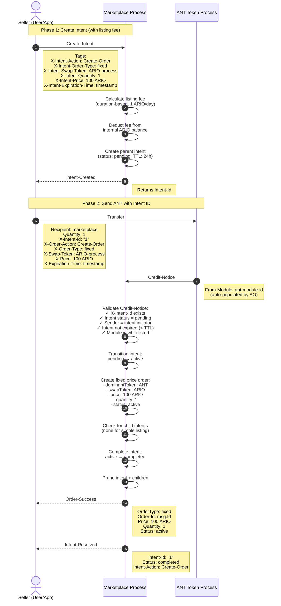
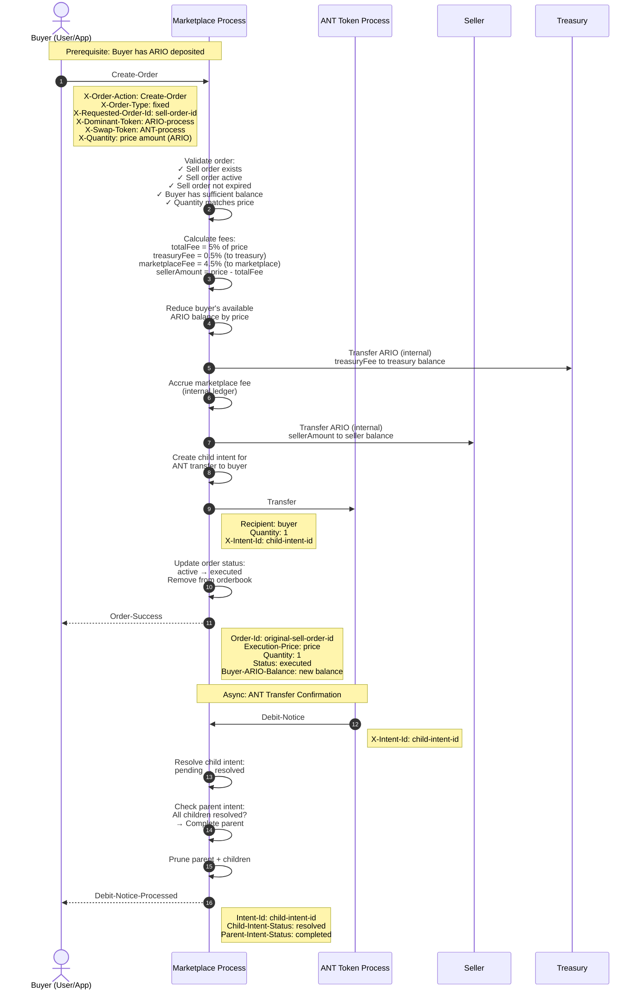

# Fixed Price Orders

## Overview

Fixed price orders enable instant buying and selling of ANTs at predetermined prices. Sellers list ANTs via the **Intent-Based Workflow Pattern** (ADR-004), while buyers purchase using the **ARIO Internal Ledger Pattern** (ADR-003) for efficient execution.

## Architecture Patterns

- **Intent-Based Workflow** (ADR-004): ANT listings tracked with parent/child intents
- **ARIO Internal Ledger** (ADR-003): Instant ARIO transfers via internal balance
- **Credit-Notice Pattern** (ADR-002): ANT transfer validation and ARIO deposit routing
- **Module Whitelist** (ADR-001): ANT module verification for security

---

## Part 1: Creating Fixed Price Listings (Sell Side)

### Listing Overview

Creating a fixed price sell order requires a two-phase approach:
1. **Phase 1**: Create intent and pay listing fee
2. **Phase 2**: Send ANT with intent ID

### Listing Workflow Diagram



### Phase 1: Create Intent (Listing Fee Payment)

**Purpose**: Reserve workflow slot and pay listing fee upfront

**Requirements**:
- Seller must have ARIO deposited in marketplace internal balance
- Sufficient balance to cover duration-based listing fee
- Valid expiration time (future timestamp, max 30 days) or no expiration

**Listing Fee Calculation**:
```
baseFee = 1 ARIO (for first day)
feeMultiplier = ceil(durationHours / 24)
totalFee = baseFee * feeMultiplier

Examples:
- 1 day listing: 1 ARIO
- 7 day listing: 7 ARIO  
- 30 day listing: 30 ARIO
- No expiration: 1 ARIO (base fee)
```

**Intent Properties**:
- `intentId`: Auto-incrementing counter (e.g., "1", "2", "3")
- `type`: "parent"
- `status`: "pending" (waiting for ANT Credit-Notice)
- `initiator`: Seller's address
- `action`: "Create-Order"
- `ttl`: createdAt + 24 hours (intent expires if ANT not sent)
- `listingFee`: Amount charged from internal balance
- `forwardedTags`: Order parameters for validation

**Error Scenarios**:
- Insufficient ARIO balance → Error: "Insufficient balance"
- Invalid expiration → Error: "Expiration time must be in the future"
- Expiration > 30 days → Error: "Expiration time cannot exceed 30 days"

### Phase 2: Send ANT with Intent ID

**Purpose**: Transfer ANT to marketplace with linkage to intent

**Requirements**:
- Valid `X-Intent-Id` tag matching the intent from Phase 1
- Intent still exists (not expired, not already resolved)
- Sender matches intent initiator
- ANT module is whitelisted (checked via `From-Module` tag)

**Credit-Notice Validation Chain**:
1. ✅ `X-Intent-Id` tag present
2. ✅ Intent exists in `Intents` global
3. ✅ Intent status is "pending"
4. ✅ `msg.Tags.Sender` equals `intent.initiator`
5. ✅ Current time < `intent.ttl` (24 hour expiration)
6. ✅ `From-Module` tag in `WhitelistedModules`

**Order Creation**:
- `id`: Message ID from ANT transfer
- `creator`: Seller address
- `token`: ANT process ID (dominantToken)
- `quantity`: "1" (always 1 ANT)
- `price`: Price per ANT in ARIO (mARIO units)
- `orderType`: "fixed"
- `status`: "active"
- `dateCreated`: Credit-Notice timestamp
- `expirationTime`: Optional expiration timestamp
- `dominantToken`: ANT process ID
- `swapToken`: ARIO process ID

**Intent Completion**:
- Simple listings have no child intents
- Intent transitions: `pending → active → completed`
- Intent + children pruned immediately after completion
- `Intent-Resolved` notice sent to seller

**Error Scenarios**:
- Intent not found → Refund ANT + Error: "Intent already resolved or does not exist"
- Sender mismatch → Refund ANT + Error: "Sender does not match intent initiator"
- Intent expired → Refund ANT + Error: "Intent expired (24h TTL)"
- Module not whitelisted → Fail intent (no refund): "ANT module not whitelisted"
- Order validation fails → Refund ANT + fail intent

### Listing Fee Economics

- **Duration-based pricing**: Longer listings cost more ARIO
- **Upfront payment**: Prevents spam and commits seller
- **Non-refundable**: Even if order cancelled or expired (fee pays for state storage)
- **Charged from internal balance**: Requires ARIO deposit first

### Intent TTL (24 Hours)

- **Purpose**: Prevents abandoned intents from accumulating
- **Prune trigger**: Passive cranking on every incoming message
- **Expired behavior**: Intent fails, listing fee not refunded (user delayed too long)
- **User recovery**: Can create new intent and retry

---

## Part 2: Purchasing Fixed Price Orders (Buy Side)

### Purchase Overview

Buyers purchase ANTs at fixed prices using their deposited ARIO balance for instant execution without external transfers.

### Purchase Workflow Diagram



### Prerequisites

**Buyer Requirements**:
1. ARIO deposited in marketplace internal balance
2. Available balance ≥ ANT price (not locked in other orders)

**Seller Requirements**:
1. Valid sell order exists (created via intent-based listing)
2. Order status is "active"
3. Order not expired
4. ANT module is whitelisted

### Order Creation Message

Buyer sends `Create-Order` message with:
- `X-Order-Action`: "Create-Order"
- `X-Order-Type`: "fixed" (optional, defaults to fixed)
- `X-Requested-Order-Id`: ID of the sell order to buy
- `X-Dominant-Token`: ARIO process ID (buyer is providing ARIO)
- `X-Swap-Token`: ANT process ID (buyer wants ANT)
- `X-Quantity`: Price amount in mARIO (must match sell order price)

**Important**: This is a direct message to marketplace, NOT a Credit-Notice. ARIO Credit-Notices with `X-Order-Action: Create-Order` are explicitly blocked (ADR-003).

### Validation

Marketplace validates:
1. ✅ Sell order exists in `Orderbook`
2. ✅ Sell order status is "active"
3. ✅ Current timestamp < sell order expiration (if set)
4. ✅ Buyer's available ARIO balance ≥ price
5. ✅ `X-Quantity` matches sell order price exactly

### Fee Calculation

```
price = sell order price (e.g., 100 ARIO = 100000000000 mARIO)
totalFeePercent = 5%
totalFee = price * 0.05

treasuryFeePercent = 0.5%
treasuryFee = price * 0.005

marketplaceFeePercent = 4.5%
marketplaceFee = price * 0.045

sellerAmount = price - totalFee
```

**Example**:
- Price: 100 ARIO (100000000000 mARIO)
- Total fee: 5 ARIO (5000000000 mARIO)
- Treasury fee: 0.5 ARIO (500000000 mARIO)
- Marketplace fee: 4.5 ARIO (4500000000 mARIO)
- Seller receives: 95 ARIO (95000000000 mARIO)

### Internal ARIO Transfers

All ARIO transfers happen **internally** (no external messages):

1. **Buyer → Deducted**: `balances.reduceBalance(buyer, price)`
   - Reduces buyer's available balance by full price
   
2. **Treasury → Credited**: `balances.increaseBalance(treasury, treasuryFee)`
   - Increases treasury's available balance
   
3. **Marketplace → Accrued**: `utils.accrueFee(marketplaceFee)`
   - Tracks marketplace fee in `AccruedFeesAmount`
   
4. **Seller → Credited**: `balances.increaseBalance(seller, sellerAmount)`
   - Increases seller's available balance (can withdraw or use for new orders)

**Performance**: All four operations complete in **O(1)** time, no external messages needed.

### ANT Transfer with Child Intent

Marketplace creates child intent and sends ANT to buyer:

```lua
ucm.transferWithIntent(buyer, "1", antProcessId, msg)
```

This:
1. Creates a child intent with status "pending"
2. Sends `Transfer` message to ANT process
3. Child intent expects `Debit-Notice` from ANT process
4. Child intent linked to parent intent (if any) for completion tracking

### Order Status Update

Order immediately transitions to "executed":
- `status`: "active" → "executed"
- Removed from `Orderbook[pair]` dictionary
- Cleared from `OrderIndex` lookup table

**Why immediate?** ARIO payment already deducted and transferred internally. Even if ANT transfer fails, it's a separate child intent that can be retried.

### Balance State Changes

**Before Purchase**:
```lua
ARIOBalances = {
  [buyer] = {
    balance = "100000000000",  -- 100 ARIO available
    orders = {}
  },
  [seller] = {
    balance = "0",
    orders = {}
  },
  [treasury] = {
    balance = "0",
    orders = {}
  }
}
```

**After Purchase**:
```lua
ARIOBalances = {
  [buyer] = {
    balance = "0",  -- 100 ARIO spent
    orders = {}
  },
  [seller] = {
    balance = "95000000000",  -- 95 ARIO received (price - fees)
    orders = {}
  },
  [treasury] = {
    balance = "500000000",  -- 0.5 ARIO fee
    orders = {}
  }
}

AccruedFeesAmount = "4500000000"  -- 4.5 ARIO marketplace fee
```

---

## ARIO Deposit Blocking

Per ADR-003, ARIO Credit-Notices with order creation are explicitly blocked:

```lua
-- In notices.creditNoticeHandler
if msg.Tags['X-Order-Action'] == 'Create-Order' and isArioToken(msg.From) then
    handleInvalidTransfer('ARIO orders must use internal balance - deposit ARIO first, then call Create-Order')
    return
end
```

**Required flow**:
1. Deposit ARIO (via Credit-Notice with `X-Action: Deposit`)
2. Create buy order (via direct `Create-Order` message using internal balance)

**Why?** Forces efficient internal ledger usage and avoids intent tracking overhead for ARIO.

---

## Order Cancellation

Seller can cancel active order:

```
Seller → Marketplace: Cancel-Order
  Order-Id: order-id

Marketplace:
1. Validates sender is order creator
2. Validates order is active (not executed)
3. Creates child intent for ANT return
4. Transfers ANT back to seller
5. Updates order status to "cancelled"
6. Removes from orderbook

Note: Listing fee NOT refunded
```

---

## Order Expiration

Automatic expiration via pruning system:

```
Pruning system (triggered on any message):
1. Detects order.expirationTime < current timestamp
2. Creates child intent for ANT return
3. Transfers ANT back to seller
4. Updates order status to "expired"
5. Removes from orderbook
6. Sends Order-Expired notice to seller

Note: Listing fee NOT refunded
```

---

## State Transitions

### Intent States
```
Created → Pending → Active → Completed
                       ↓
                    Failed
```

### Order States  
```
Created → Active → Executed (when bought)
              ↓
           Cancelled (manual cancel)
              ↓
           Expired (via pruning)
```

---

## Error Scenarios

### Listing Errors
- Insufficient ARIO for fee → Error: "Insufficient balance"
- Invalid expiration → Error: "Expiration time must be in the future"
- Intent expired → Refund ANT: "Intent expired (24h TTL)"
- Module not whitelisted → Fail intent (no refund): "ANT module not whitelisted"

### Purchase Errors
- Insufficient balance → Error: "Insufficient balance"
- Order not found → Error: "Order not found"
- Order expired → Error: "Order expired"
- Price mismatch → Error: "Quantity does not match order price"
- ANT transfer failure → Intent fails, ARIO not refunded automatically

---

## Notice Emissions

### Listing Path
- `Intent-Created` (after Phase 1)
- `Order-Success` (after Phase 2)
- `Intent-Resolved` (after Phase 2)

### Purchase Path
- `Order-Success` (immediate after execution)
- `Debit-Notice-Processed` (when ANT confirms)

### Cancellation/Expiration Path
- `Order-Cancelled` or `Order-Expired`
- `Debit-Notice-Processed` (when ANT return confirms)

### Error Path
- `Validation-Error` (if validation fails)
- `Transfer-Error` (if ANT transfer fails)

---

## References

- **ADR-004**: Intent-Based Workflow Pattern
- **ADR-003**: ARIO Internal Ledger Pattern
- **ADR-002**: Credit-Notice Pattern
- **ADR-001**: Module Whitelist for ANT Trading
- **FEATURE_CHECKLIST.md**: Complete feature implementation status
- **Source**: `src/intents.lua`, `src/notices.lua`, `src/fixed_price.lua`, `src/balances.lua`, `src/ucm.lua`

